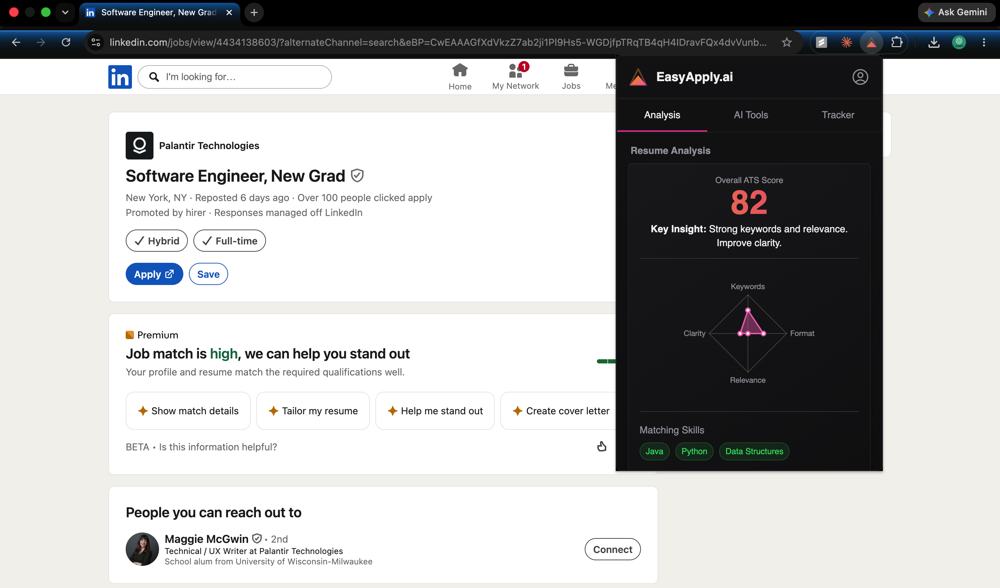
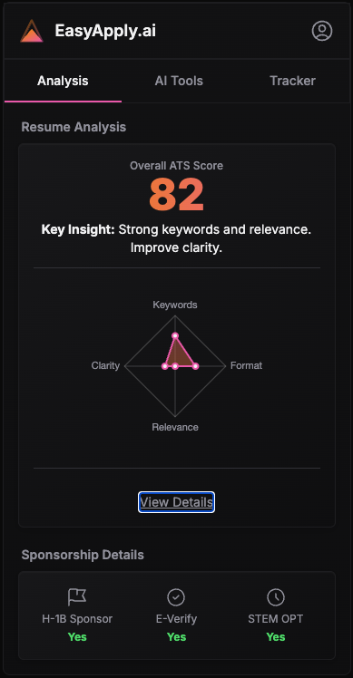
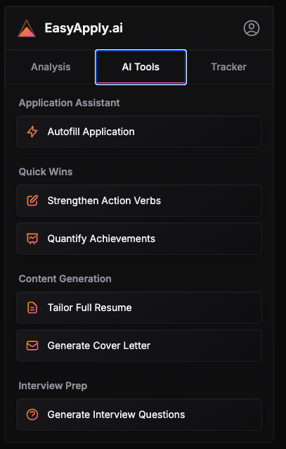
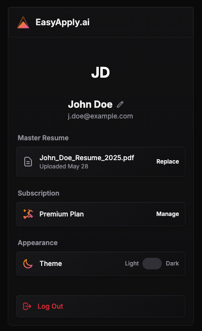

# EasyApply.ai

EasyApply.ai is an intelligent, AI-powered Chrome browser copilot designed to automate, parse, and streamline job application workflows. By leveraging local extraction models and intelligent form matching, the extension simplifies the process of completing online job applications across various job portals.

---

## 🚀 Features

- 🤖 **AI-Powered Job Application Assistant:** Seamlessly auto-fills fields using context-aware matching.
- 📊 **Intelligent Resume Analysis:** Generates real-time ATS scoring breakdowns (Keywords, Format, Relevance, Clarity) directly alongside job descriptions.
- 📋 **Application Pipeline Tracker:** Log your progress from 'Applied' to 'Interview' and 'Offer' with intuitive visual pipelines.
- 🔍 **Sponsorship Insights:** Instantly checks company alignment for H-1B, E-Verify, and STEM OPT status.
- 💻 **Privacy First:** Runs inference models locally for maximum data privacy and performance.
- 🌐 **Chrome Native:** Integrates smoothly as a side-panel extension inside Google Chrome.

---

## 📸 Screenshots

### Product Preview
<p align="center">
  
</p>

<p align="center">
  
  
  
  
</p>

---

# Installation
Follow the steps below to build and load the extension into Chrome.

## Prerequisites
Make sure you have the following installed:

- Node.js (v18 or later recommended)
- npm
- Google Chrome
  
---
## Step 1: Build the Extension
Clone the repository and install dependencies.

```bash
npm install
```
Build the production version of the extension.

```bash
npm run build
```
This command compiles the React frontend along with the background AI parsing scripts and generates a production-ready build inside the `dist/` directory.

---
## Step 2: Open Chrome Extensions
Open Google Chrome and navigate to:

```
chrome://extensions
```

---
## Step 3: Enable Developer Mode

1. Locate the **Developer mode** toggle in the top-right corner.
2. Turn **Developer mode** **ON**.

---
## Step 4: Load the Extension
1. Click **Load unpacked**.
2. Browse to your local `easyapply-ai` project.
3. Select the generated **dist** folder.

```
easyapply-ai/

├── dist/

├── src/

├── package.json

└── ...

```
Chrome will install the extension.

---
## Step 5: Start Using EasyApply.ai

After installation:
- The **EasyApply.ai** extension will appear in your extensions list.
- Pin the extension to your Chrome toolbar for quick access.
- Browse supported job boards and launch the AI assistant whenever needed.

---
## Development
To start the development server:

```bash
npm run dev
```
To create a production build:

```bash
npm run build
```
---

## Notes
- If the extension doesn't appear after loading, refresh the Extensions page and try loading the `dist` folder again.

